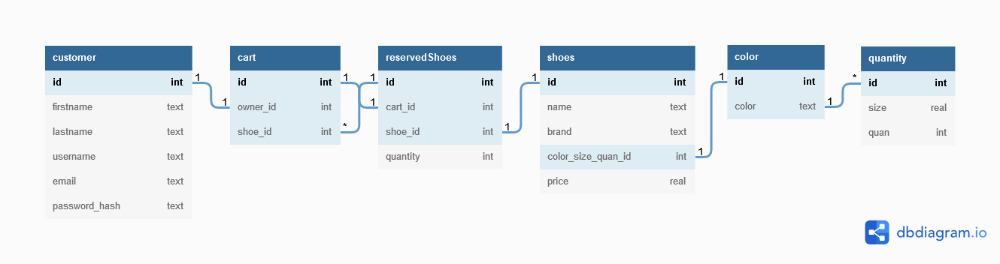

# Sneaker Head Shoe E-store
This project was created with
- python using the microframework [Flask](URL 'https://flask.palletsprojects.com/en/2.1.x/')
- sqlite database managed with [flask_sqlalchemy](URL 'https://flask-sqlalchemy.palletsprojects.com/en/2.x/')
- jQuery to send asynchronous HTTP (Ajax) requests to the webserver
- javascript to manipulate the DOM
- sass to make managing the css across the site more efficent
- This web app is hosted via Heroku and can found at [sneakerhead-shoe-estore.herokuapp.com](URL 'https://sneakerhead-shoe-estore.herokuapp.com/')

### The Database Design

## How to Install and Run
First Clone the Repo and cd into it
`gitclone https://github.com/mkowusujr/sneakerhead-shoe-estore.git`

Next run `pip install -r requirements` in your commandline. You can do this in a python virtual environment to keep the versions of the dependices isolated in the project folder and not affect the depencies of any other python projects you may have on your system. [Learn more here](URL 'https://medium.com/co-learning-lounge/create-virtual-environment-python-windows-2021-d947c3a3ca78')

Lastly run the web app with `python main.py` and open the localhost outputted in the terminal in your web browser

## Credits
[Thanks to Mordka for the list of colors](URL 'https://gist.github.com/mordka/c65affdefccb7264efff77b836b5e717')

[The site where I got my site icon from](URL 'http://clipart-library.com/clip-art/shoe-transparent-background-12.htm')